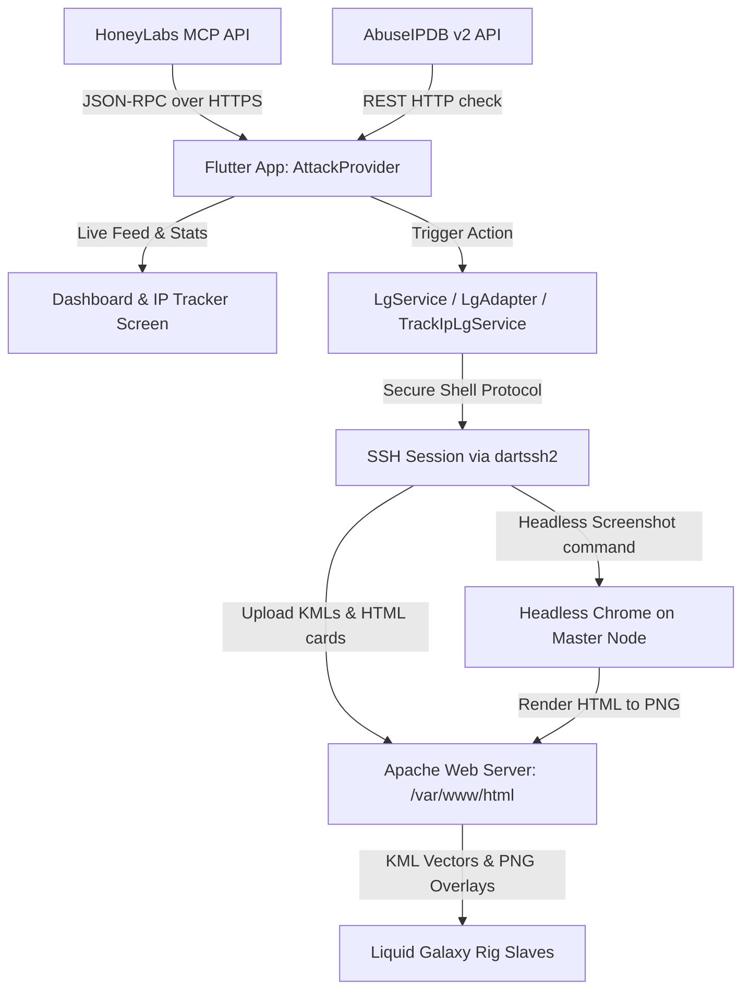

# 🛡️ HoneyVision: Cyber Threat Visualizer for Liquid Galaxy

HoneyVision is a premium, real-time cyber security threat monitoring dashboard built with Flutter. It aggregates live honeypot telemetry and queries global threat intelligence platforms to project attack vectors, attacker telemetry cards, and victim/reporter markers across a **Liquid Galaxy** multi-screen rig using custom-generated 3D arced KML maps and screen overlays.

---

## 📌 Architecture & Data Flow



---

## 🌟 Core Features

### 1. Live Threat Telemetry Dashboard
* **Real-time Honeypot Monitoring:** Polls the HoneyLabs Model Context Protocol (MCP) endpoint to query recent cyber probe logs.
* **Global Statistics Analytics:** Aggregates live metadata including total threat counts, unique attacker IPs, unique source countries, and unique target autonomous systems (ASNs).
* **Target Coordinates Manager:** Allows customization of the target coordinate center (defaults to **Delhi, India**, but easily customizable to Spain, USA, Singapore, Australia, or custom latitude/longitude inputs) where attack vectors converge.

### 2. Deep IP Threat Tracker
* **AbuseIPDB Integration:** Searches historical threat logs for a specific IP address within a custom day window (1–30 days).
* **Incident Reports Feed:** Lists individual reporter metadata, country flags/names, report categories, and comment text.
* **Geo-distributed Victims mapping:** Visualizes the threat on the Liquid Galaxy globe by showing lines connecting the attacker node and all the individual reporter node regions that flagged that IP.

### 3. Advanced Liquid Galaxy Integration
* **3D Parabolic Vector Curves:** Computes geographic distance and bearing using the **Haversine formula**, producing 3D arced lines that raise in altitude proportional to target distance (up to a 1,200km ceiling) to present high-end cyber attack flight path animations.
* **Headless HTML-to-PNG Screen Overlays:** Bypasses Google Earth's lack of support for modern CSS/SVGs by writing customized HTML/CSS overlay cards to the master node, running headless Chromium/Chrome to capture screenshots, and feeding the resulting PNG files as `<ScreenOverlay>` tags to the rightmost screen.
* **Automated Camera Flight & Focus:** Moves the viewport (`<LookAt>`/`<flyTo>`) dynamically to focus on the attacker's home region at a custom tilt (45 degrees) and scale.
* **Linux Shell Power Controller:** Provides settings for SSH configuration (with persistence using `shared_preferences`) alongside options to trigger a full Liquid Galaxy rig reboot, power down, or application relaunch (supporting `lightdm` and `gdm3`).

---

## 🔌 Data Sources & APIs

HoneyVision leverages two core external threat intelligence sources:

| Source | Endpoint | API Protocol | Used for... |
| :--- | :--- | :--- | :--- |
| **HoneyLabs** | `https://mcp.honeylabs.net/mcp` | JSON-RPC (SSE Compatible) | Live honeypot threat stream feed, target ports, protocols, and origin geolocation. |
| **AbuseIPDB** | `https://api.abuseipdb.com/api/v2/check` | REST HTTPS GET | Individual IP reputation scoring, ISP, domain, coordinates, and historic reporter logs. |

---

## 🛠️ Technical Approach & Workarounds

* **Multi-Screen Synchronisation:** Liquid Galaxy slave nodes are queried through target configurations in a virtual `kmls.txt` index file (e.g. `slave_1=http://lg1:81/...kml`). 
* **Liquid Galaxy Screen Refresh Technique:** When overlay KMLs are updated, Liquid Galaxy often fails to redraw immediately. HoneyVision resolves this by issuing a temporary Linux `sed` edit over SSH to set `refreshMode` to `onInterval` with a `refreshInterval` of `1` second on `/~/earth/kml/slave/myplaces.kml`, delaying `1` second, and restoring the original configuration.
* **Dart Provider Architecture:** Decouples UI screens from business logic. State flows from `HoneyLabsService` and `AbuseIpDbService` through repository layers, into `AttackProvider` and `TrackIpProvider` which control the widgets.

---

## 🚀 Local Setup & Installation

### 📋 Prerequisites
* **Flutter SDK:** Version `^3.12.0` (Dart `^3.0.0`)
* **Git** installed on your system.
* Active API Keys for **HoneyLabs** and **AbuseIPDB**.

### 🔧 Environment Setup
1. Create a file named `.env` in the root folder of the project.
2. Fill in your credentials using the following structure:

```env
# HoneyLabs API key for honeypot telemetry
HONEYLAB_API_KEY = your_honeylab_key_here

# AbuseIPDB API key for reputation lookups
ABUSEIPDB_API_KEY = your_abuseipdb_key_here
```

> [!WARNING]
> Keep the `.env` file registered in your assets inside `pubspec.yaml` to ensure it is bundled correctly into the application executable resources at runtime.

### 🏃 Running the Application
To launch HoneyVision locally, execute the following commands in your shell:

```powershell
# 1. Fetch dependencies
flutter pub get

# 2. Check for connected devices (e.g. Chrome, Android, Windows Desktop)
flutter devices

# 3. Launch the application (select Chrome or Desktop mode)
flutter run
```

### 🧪 Running Unit & Widget Tests
The project features complete test suites (located in the `test/` directory) verifying model parser safety, state repository caches, coordinate lookups, and widget layouts. Run them using:

```powershell
flutter test
```

---

## 🖥️ Liquid Galaxy Configuration Guidelines

For the visualisations to render on a physical Liquid Galaxy rig, the Master node must comply with the following:
1. **SSH Server Active:** Listening on the target configured port (default `22`).
2. **Apache Server Running:** Listening on port `81` (default folder configured is `/var/www/html/` to upload and serve generated KML/PNG files).
3. **Headless Browser Installed:** Either `google-chrome`, `google-chrome-stable`, `chromium-browser`, or `chromium` must be installed on the master node path for overlay card screenshot generation.
