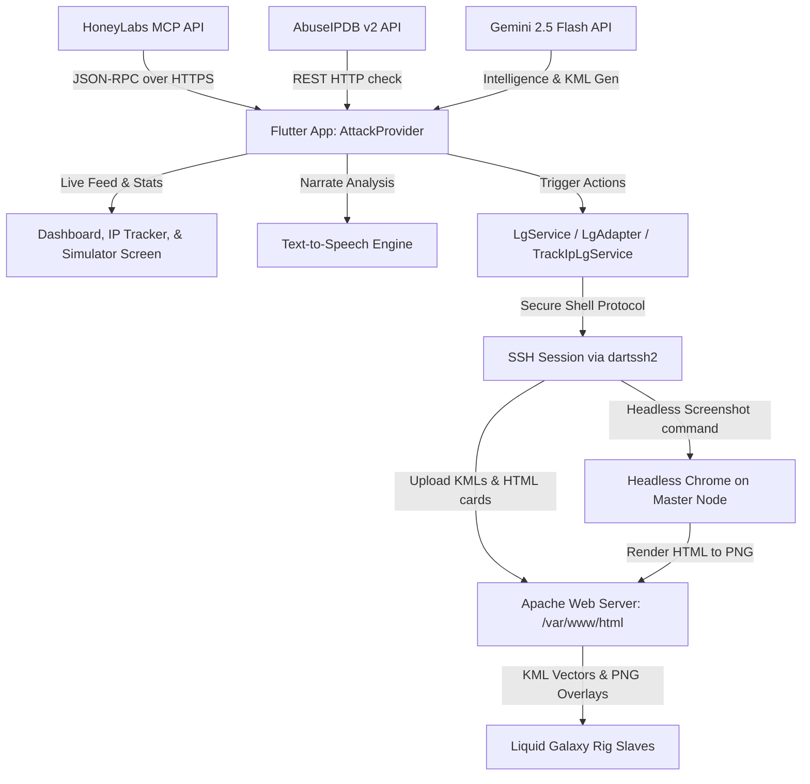

# 🛡️ HoneyVision: Cyber Threat Visualizer for Liquid Galaxy

HoneyVision is a premium, real-time cyber security threat monitoring dashboard built with Flutter. It aggregates live honeypot telemetry, queries global threat intelligence platforms, and utilizes state-of-the-art Generative AI to project threat vectors, dynamic attacker/victim markers, and live HTML-to-PNG overlay cards across a **Liquid Galaxy** multi-screen rig.

It incorporates **Gemini AI** to perform deep behavioral threat analysis and power a natural-language **Attack Simulator** that compiles text prompts into custom KML visual sequences. Additionally, it integrates a **Text-to-Speech (TTS)** engine for hands-free audio threat briefing.

---

## 📌 Architecture & Data Flow


```mermaid
graph TD
    %% Source APIs
    HoneyLabs[HoneyLabs MCP API] -->|JSON-RPC over HTTPS| AppController[Flutter App: AttackProvider]
    AbuseIPDB[AbuseIPDB v2 API] -->|REST HTTP check| AppController
    Gemini[Gemini 2.5 Flash API] -->|Intelligence & KML Gen| AppController
    
    %% UI Layer
    AppController -->|Live Feed & Stats| UI[Dashboard, IP Tracker, & Simulator Screen]
    AppController -->|Narrate Analysis| TTS[Text-to-Speech Engine]
    
    %% SSH Controller
    AppController -->|Trigger Actions| LgService[LgService / LgAdapter / TrackIpLgService]
    LgService -->|Secure Shell Protocol| SSH[SSH Session via dartssh2]
    
    %% Liquid Galaxy System
    SSH -->|Upload KMLs & HTML cards| Apache[Apache Web Server: /var/www/html]
    SSH -->|Headless Screenshot command| Chrome[Headless Chrome on Master Node]
    Chrome -->|Render HTML to PNG| Apache
    
    %% Display Nodes
    Apache -->|KML Vectors & PNG Overlays| LG[Liquid Galaxy Rig Slaves]
```

---

## 🌟 Core Features

### 1. Live Threat Telemetry Dashboard
* **Real-time Honeypot Monitoring:** Polls the HoneyLabs Model Context Protocol (MCP) endpoint to query live cyber probe logs.
* **Global Statistics Analytics:** Aggregates live metadata including total threat counts, unique attacker IPs, unique source countries, and unique target autonomous systems (ASNs).
* **Target Coordinates Manager:** Allows customization of the target coordinate center (defaults to **Delhi, India**, but customizable to Spain, USA, Singapore, Australia, or custom latitude/longitude inputs) where attack vectors converge.
* **Gemini Threat Insights:** Queries the Gemini 2.5 Flash API to generate category-specific threat intelligence summaries. These insights are displayed in-app and synced as a custom overlay to the Liquid Galaxy screens.
* **Text-to-Speech Narration:** Provides hands-free audio narration of threat reports, stripping markdown syntax for clear, natural speech synthesis.

### 2. Deep IP Threat Tracker
* **AbuseIPDB Integration:** Searches historical threat logs for a specific IP address within a custom day window (1–30 days).
* **Incident Reports Feed:** Lists individual reporter metadata, country flags/names, report categories, and comment text.
* **Geo-distributed Victims Mapping:** Visualizes the threat on the Liquid Galaxy globe by showing lines connecting the attacker node and all the individual reporter node regions that flagged that IP.
* **Gemini IP Analysis:** Analyzes the reputation history, ISP metadata, and reporter comments of the specific IP to output structured profiles, behavior assessments, and defensive recommendations.

### 3. AI-Powered Attack Simulator
* **Natural Language Simulation:** Translates natural language descriptions (e.g., *"brute-force ssh attack from china and russia on a server in germany"*) into functional geographic KML data.
* **Smart Coordinate Parsing:** Automatically translates location names mentioned in the prompt into approximate coordinates.
* **Interactive Visualization:** Dynamically generates attack paths, attacker/victim nodes, and moves the Liquid Galaxy viewport (`<LookAt>`) to focus on the target region at an optimal tilt and zoom level.

### 4. Advanced Liquid Galaxy Integration
* **3D Parabolic Vector Curves:** Computes geographic distance and bearing using the **Haversine formula**, producing 3D arced lines that raise in altitude proportional to target distance (up to a 1,200km ceiling) to present high-end cyber attack flight path animations.
* **Headless HTML-to-PNG Screen Overlays:** Bypasses Google Earth's lack of support for modern CSS/SVGs by writing customized HTML/CSS overlay cards to the master node, running headless Chromium/Chrome to capture screenshots, and feeding the resulting PNG files as `<ScreenOverlay>` tags to the rightmost screen.
* **Automated Camera Flight & Focus:** Moves the viewport (`<LookAt>`/`<flyTo>`) dynamically to focus on the attacker's home region at a custom tilt (45 degrees) and scale.
* **Linux Shell Power Controller:** Provides settings for SSH configuration (with persistence using `shared_preferences`) alongside options to trigger a full Liquid Galaxy rig reboot, power down, or application relaunch (supporting `lightdm` and `gdm3`).

---

## 🔌 Data Sources & APIs

HoneyVision leverages three core external APIs:

| Source | Endpoint | API Protocol | Used for... |
| :--- | :--- | :--- | :--- |
| **HoneyLabs** | `https://mcp.honeylabs.net/mcp` | JSON-RPC (SSE Compatible) | Live honeypot threat stream feed, target ports, protocols, and origin geolocation. |
| **AbuseIPDB** | `https://api.abuseipdb.com/api/v2/check` | REST HTTPS GET | Individual IP reputation scoring, ISP, domain, coordinates, and historic reporter logs. |
| **Gemini AI** | `https://generativelanguage.googleapis.com/...` | REST HTTPS POST | Category/IP threat analysis reports, natural-language KML attack simulation generation. |

---

## 🛠️ Technical Approach & Workarounds

* **Multi-Screen Synchronisation:** Liquid Galaxy slave nodes are queried through target configurations in a virtual `kmls.txt` index file (e.g. `slave_1=http://lg1:81/...kml`). 
* **Liquid Galaxy Screen Refresh Technique:** When overlay KMLs are updated, Liquid Galaxy often fails to redraw immediately. HoneyVision resolves this by issuing a temporary Linux `sed` edit over SSH to set `refreshMode` to `onInterval` with a `refreshInterval` of `1` second on `/~/earth/kml/slave/myplaces.kml`, delaying `1` second, and restoring the original configuration.
* **Dart Provider Architecture:** Decouples UI screens from business logic. State flows from service files through repository layers, into `AttackProvider` and `TrackIpProvider` which control the widgets.
* **LLM-to-KML Extraction:** Bypasses LLM output noise by using rigorous regex rules to isolate and extract clean KML blocks from the raw Gemini response before pushing them to the Liquid Galaxy master node.

---

## 🚀 Local Setup & Installation

### 📋 Prerequisites
* **Flutter SDK:** Version `^3.12.0` (Dart `^3.0.0`)
* **Git** installed on your system.
* Active API Keys for **HoneyLabs**, **AbuseIPDB**, and **Gemini AI**.
* A Google Maps API key (for in-app map rendering).

### 🔧 Environment Setup

#### 1. Threat Intelligence Credentials
You can configure threat credentials in two ways:

##### Option A: User Settings Interface (Recommended)
1. Launch the application.
2. Open the **Drawer Menu** and select **Connection Settings**.
3. Scroll to the **API Credentials** card.
4. Input your custom **HoneyLabs API Key**, **AbuseIPDB API Key**, and **Gemini API Key** and tap **Save Settings**.
5. Custom keys are securely saved locally via `SharedPreferences`.

##### Option B: Assets .env File
1. Create a file named `.env` in the root folder of the project.
2. Fill in your credentials using the following structure:
   ```env
   # HoneyLabs API key for honeypot telemetry
   HONEYLAB_API_KEY = your_honeylab_key_here

   # AbuseIPDB API key for reputation lookups
   ABUSEIPDB_API_KEY = your_abuseipdb_key_here

   # Gemini API key for intelligence analysis & simulation
   GEMINI_API_KEY = your_gemini_key_here
   ```
3. Verify that `.env` is listed under assets in your `pubspec.yaml` to ensure it is bundled correctly into the application executable resources at runtime.

#### 2. Android Google Maps API Key Setup
If running on Android, you must configure the Google Maps API Key:
1. Locate the file `strings.xml.example` in the root directory. Change it's name to `strings.xml`.
2. Open that `strings.xml` and replace the value with your actual Google Maps API key:
   ```xml
   <?xml version="1.0" encoding="utf-8"?>
   <resources>
       <string name="GOOGLE_MAPS_API_KEY">YOUR_GOOGLE_MAPS_API_KEY</string>
   </resources> 
   ```

---

## 🏃 Running the Application

To launch HoneyVision locally, execute the following commands in your terminal:

### 1. Fetch Dependencies
```powershell
flutter pub get
```

### 2. Check for Connected Devices
Verify that your target device (e.g. Chrome, Android emulator, or Windows Desktop) is detected:
```powershell
flutter devices
```

### 3. Launch the Application
Run the project on your preferred target device:

* **Desktop Mode (Windows):**
  ```powershell
  flutter run -d windows
  ```
* **Web Mode (Google Chrome):**
  ```powershell
  flutter run -d chrome
  ```
* **Mobile Mode (Android Device/Emulator):**
  ```powershell
  flutter run -d android
  ```

---

## 🖥️ Operating Guide: How to Use

### 1. Configure the Liquid Galaxy Rig Connection
1. Navigate to the **Connection Settings** page in the drawer.
2. Input the Master Node SSH credentials:
   * **IP Address** (e.g. `192.168.0.1`)
   * **Port** (usually `22`)
   * **Username** & **Password**
   * **Number of Screens** (e.g., `3` or `5`)
3. Tap **Connect** to initialize the secure SSH tunnel.

### 2. Monitoring Live Honeypot Telemetry
1. Open the **Dashboard** page.
2. Watch the incoming real-time cyber attacks mapped live.
3. Change the target coordinate focus by tapping one of the preset centers (Delhi, Spain, USA, Singapore, Australia) or entering custom coordinates. The arced 3D vector curves will immediately redraw to target the new destination.
4. Tap **Gemini Insights** on any attack category card to request AI analysis. Tap the **Speaker Icon** to have the report read out via text-to-speech.

### 3. Investigating an Attacker IP
1. Navigate to the **Track IP** page.
2. Enter the target IP address and set the custom day range.
3. Tap **Track IP** to view the geographical distribution, ISP records, and reports feed.
4. Tap **Analyze with Gemini** to review structured behavioral reports. Use the TTS controller to listen to the analysis.

### 4. Running Attack Simulations
1. Navigate to the **Attack Simulator** page.
2. Select a quick preset scenario chip or write your own custom prompt describing a threat incident.
3. Tap **Simulate Scenario**. The app will use Gemini to synthesize a new KML file, project the vectors on the Liquid Galaxy screens, and fly the camera straight to the target location.
4. Tap the **Trash/Clear Icon** to purge simulation visuals from the rig.

---

## 🖥️ Liquid Galaxy Environment Configuration Guidelines

For the visualisations to render on a physical Liquid Galaxy rig, the Master node must comply with the following:
1. **SSH Server Active:** Listening on the target configured port (default `22`).
2. **Apache Server Running:** Listening on port `81` (default folder configured is `/var/www/html/` to upload and serve generated KML/PNG files).
3. **Headless Browser Installed:** Either `google-chrome`, `google-chrome-stable`, `chromium-browser`, or `chromium` must be installed on the master node path for overlay card screenshot generation.

